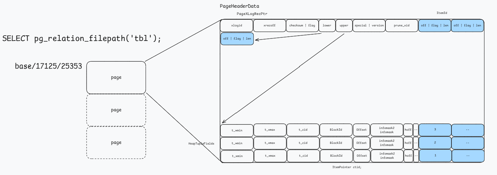
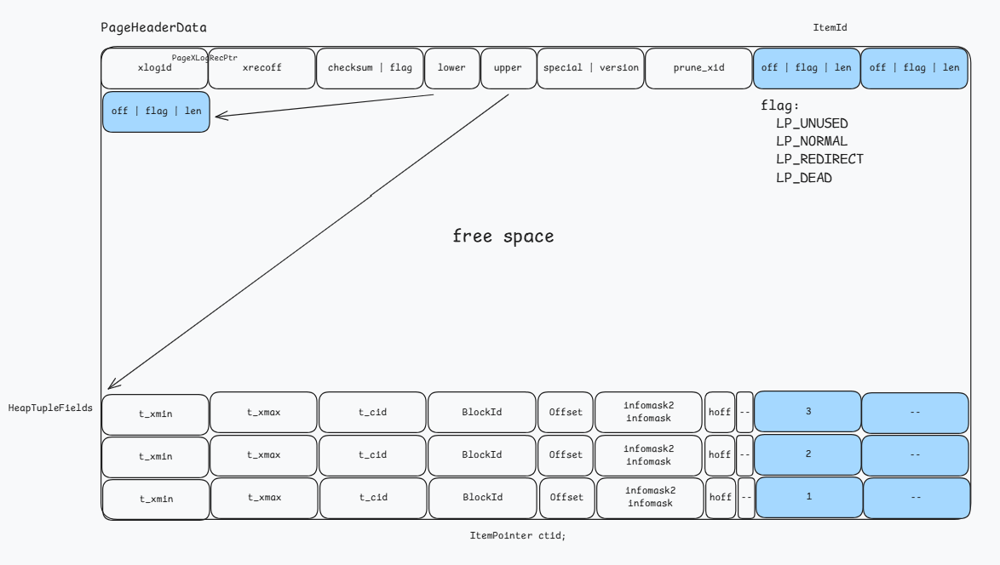

# Storage

## table and file

```sql
-- 空表初始文件 0 KB
create table tbl (a int);

-- 插入第一行数据，文件扩展为 8 KB
insert into tbl values (1);

-- 获取表的文件路径
select pg_relation_filepath('tbl');
```



## pageinspect 介绍

- PostgreSQL 提供的一个内省扩展模块
- 允许用户通过 SQL 界面直接观察磁盘数据页（Page）的原始二进制内容及元数据结构
- 代码位于 `postgres/contrib/pageinspect/`，编译后使用 

```sql
create extension pageinspect;
```

常用函数说明：

- get_raw_page: 从磁盘读取原始 8KB 数据块
- page_header: 查看 LSN、lower、upper 等页头元数据
- heap_page_items: 解析行指针和元组头（xmin, xmax）

- bt_page_items: 查看索引记录及其指向的元组地址
- heap_page_item_attrs: 解码字段内容

## page

查询页头信息

```sql
select * from page_header(get_raw_page('tbl', 0));
+-----------+----------+-------+-------+-------+---------+----------+---------+-----------+
|    lsn    | checksum | flags | lower | upper | special | pagesize | version | prune_xid |
+-----------+----------+-------+-------+-------+---------+----------+---------+-----------+
| 0/2926898 |        0 |     0 |    28 |  8160 |    8192 |     8192 |       4 |         0 |
+-----------+----------+-------+-------+-------+---------+----------+---------+-----------+
```

继续插入两条数据

```sql
insert into tbl values (1), (1);
```

再次查询页头信息

```sql
select * from page_header(get_raw_page('tbl', 0));
+-----------+----------+-------+-------+-------+---------+----------+---------+-----------+
|    lsn    | checksum | flags | lower | upper | special | pagesize | version | prune_xid |
+-----------+----------+-------+-------+-------+---------+----------+---------+-----------+
| 0/2926978 |        0 |     0 |    36 |  8096 |    8192 |     8192 |       4 |         0 |
+-----------+----------+-------+-------+-------+---------+----------+---------+-----------+
```

- lower += 8
- upper -= 64


原因



源码结构

```cpp
typedef struct PageHeaderData
{
	/* XXX LSN is member of *any* block, not only page-organized ones */
	PageXLogRecPtr pd_lsn;		/* LSN */
	uint16		pd_checksum;	/* checksum */
	uint16		pd_flags;		/* flag bits, see below */
	LocationIndex pd_lower;		/* offset to start of free space */
	LocationIndex pd_upper;		/* offset to end of free space */
	LocationIndex pd_special;	/* offset to start of special space */
	uint16		pd_pagesize_version;
	TransactionId pd_prune_xid; /* oldest prunable XID, or zero if none */
	ItemIdData	pd_linp[FLEXIBLE_ARRAY_MEMBER]; /* line pointer array */
} PageHeaderData;
```

## tuple

`HeapTupleData`: 元组在内存中的管理工具（内存句柄）
`HeapTupleHeaderData`: 元组在磁盘上的二进制布局（物理实体）

```cpp
/* HeapTupleData is an in-memory data structure that points to a tuple */
typedef struct HeapTupleData
{
	uint32		t_len;			/* length of *t_data */
	ItemPointerData t_self;		/* SelfItemPointer */
	Oid			t_tableOid;		/* table the tuple came from */
	HeapTupleHeader t_data;		/* -> tuple header and data */
} HeapTupleData;
```

```cpp
struct HeapTupleHeaderData
{
	union
	{
		HeapTupleFields t_heap;
		DatumTupleFields t_datum;
	}			t_choice;
	ItemPointerData t_ctid;		/* current TID of this or newer tuple */
	uint16		t_infomask2;	/* number of attributes + various flags */
	uint16		t_infomask;		/* various flag bits, see below */
	uint8		t_hoff;			/* sizeof header incl. bitmap, padding */
	/* ^ - 23 bytes - ^ */
    
	bits8		t_bits[FLEXIBLE_ARRAY_MEMBER];	/* bitmap of NULLs */

	/* MORE DATA FOLLOWS AT END OF STRUCT */
};
```

## update

```sql
-- 执行一次更新，制造旧版本数据
UPDATE test_mvcc SET val = 'world' WHERE id = 1;
```