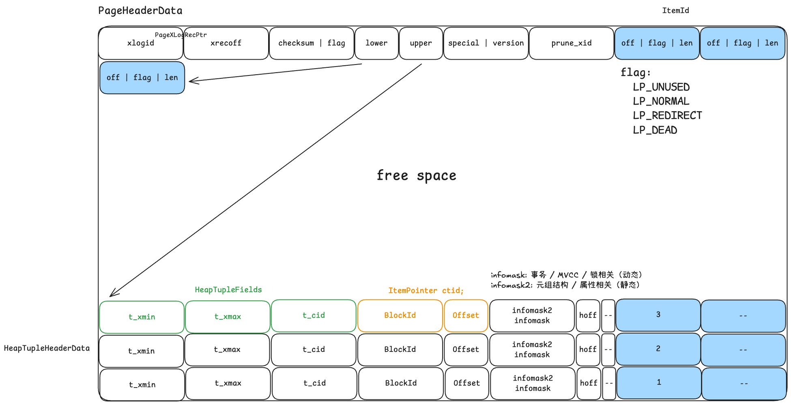

# Storage

## table and page

```sql
-- 空表初始文件 0 KB
create table tb (a int);

-- 插入第一行数据，文件扩展为 8 KB
insert into tb values (1), (2), (3);
```



## `pageinspect` 介绍

- PostgreSQL 提供的一个内省扩展模块
- 允许用户通过 SQL 界面直接观察磁盘数据页（Page）的原始二进制内容及元数据结构
- 代码位于 `postgres/contrib/pageinspect/`，编译后使用 

```sh
# 1. 自动获取PG服务端头文件目录（模糊化安装路径） 
PG_INCLUDE=$(<PG_INSTALL_DIR>/bin/pg_config --includedir-server) 

# 2. 编译扩展（指定PG版本+头文件路径） 
make PG_CONFIG=<PG_INSTALL_DIR>/bin/pg_config CPPFLAGS="-I$PG_INCLUDE" 

# 3. 安装扩展（指定PG版本） 
make install PG_CONFIG=<PG_INSTALL_DIR>/bin/pg_config
```

psql 客户端运行

```sql
create extension pageinspect;
```

常用函数说明：

- `get_raw_page`: 从磁盘读取原始 8KB 数据块
- `page_header`: 查看 LSN、lower、upper 等页头元数据
- `heap_page_items`: 解析行指针和元组头（xmin, xmax）

- `bt_page_items`: 查看索引记录及其指向的元组地址
- `heap_page_item_attrs`: 解码字段内容

## page

查询页头信息

```sql
select * from page_header(get_raw_page('tb', 0));
+-----------+----------+-------+-------+-------+---------+----------+---------+-----------+
|    lsn    | checksum | flags | lower | upper | special | pagesize | version | prune_xid |
+-----------+----------+-------+-------+-------+---------+----------+---------+-----------+
| 0/2926978 |        0 |     0 |    36 |  8096 |    8192 |     8192 |       4 |         0 |
+-----------+----------+-------+-------+-------+---------+----------+---------+-----------+
```

原因


源码结构

```cpp
typedef struct PageHeaderData
{
	/* XXX LSN is member of *any* block, not only page-organized ones */
	PageXLogRecPtr pd_lsn;		/* LSN */
	uint16		pd_checksum;	/* checksum */
	uint16		pd_flags;		/* flag bits, see below */
	LocationIndex pd_lower;		/* offset to start of free space */
	LocationIndex pd_upper;		/* offset to end of free space */
	LocationIndex pd_special;	/* offset to start of special space */
	uint16		pd_pagesize_version;
	TransactionId pd_prune_xid; /* oldest prunable XID, or zero if none */
	ItemIdData	pd_linp[FLEXIBLE_ARRAY_MEMBER]; /* line pointer array */
} PageHeaderData;
```

## tuple

```sql
select lp, lp_off, lp_flags, lp_len, t_xmin, t_xmax, t_field3, t_ctid, t_infomask from heap_page_items(get_raw_page('tb', 0));
+----+--------+----------+--------+--------+--------+----------+--------+------------+
| lp | lp_off | lp_flags | lp_len | t_xmin | t_xmax | t_field3 | t_ctid | t_infomask |
+----+--------+----------+--------+--------+--------+----------+--------+------------+
|  1 |   8160 |        1 |     28 |   1228 |      0 |        0 | (0,1)  |       2048 |
+----+--------+----------+--------+--------+--------+----------+--------+------------+
```


`ItemIdData`: 元组行指针 line pointer
`HeapTupleHeaderData`: 元组在磁盘上的二进制布局信息

```cpp
typedef struct ItemIdData
{
	unsigned	lp_off:15,		/* offset to tuple (from start of page) */
				lp_flags:2,		/* state of line pointer, see below */
				lp_len:15;		/* byte length of tuple */
} ItemIdData;

typedef struct HeapTupleFields
{
	TransactionId t_xmin;		/* inserting xact ID */
	TransactionId t_xmax;		/* deleting or locking xact ID */

	union
	{
		CommandId	t_cid;		/* inserting or deleting command ID, or both */
		TransactionId t_xvac;	/* old-style VACUUM FULL xact ID */
	}			t_field3;
} HeapTupleFields;

struct HeapTupleHeaderData
{
	union
	{
		HeapTupleFields t_heap;
		DatumTupleFields t_datum;
	}			t_choice;
	ItemPointerData t_ctid;		/* current TID of this or newer tuple */
	uint16		t_infomask2;	/* number of attributes + various flags */
	uint16		t_infomask;		/* various flag bits, see below */
	uint8		t_hoff;			/* sizeof header incl. bitmap, padding */
	/* ^ - 23 bytes - ^ */
    
	bits8		t_bits[FLEXIBLE_ARRAY_MEMBER];	/* bitmap of NULLs */

	/* MORE DATA FOLLOWS AT END OF STRUCT */
};
```