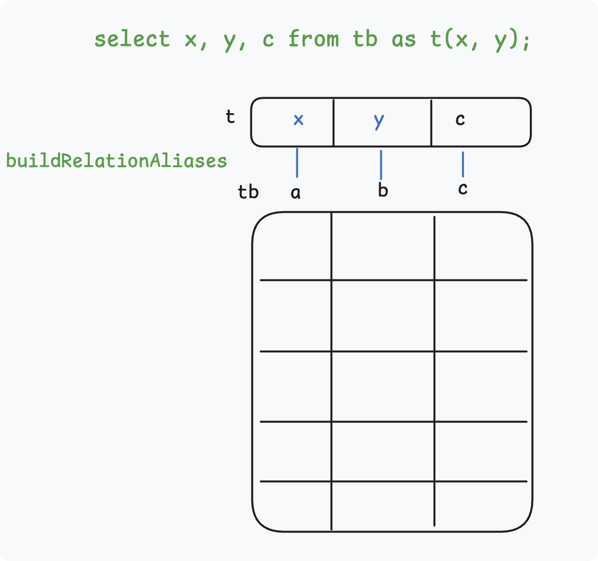

# 语义分析 `parse_analyze_fixedparams`

## Overview

### 语义分析任务

语义分析: 将以 `RawStmt` 节点为根的原始解析树(Parse Tree)，转换为 Query 节点树

1. 相关函数: `parse_analyze_fixedparams`

2. 核心流程

`RawStmt/parsetree` ----> `parse analysis（analyze.c）` + `ParseState` ----> `Query`

3. 关键结构：

- `ParseState`: 语义分析的工作上下文（working context），转换 `ParseTree` 为 `Query` 结构的**临时结构**，生成 `Query` 后丢弃

```cpp
/* State information used during parse analysis */
struct ParseState
{
	const char *p_sourcetext;	/* source text, or NULL if not available */
	List	   *p_rtable;		/* range table so far */
	List	   *p_joinexprs;	/* JoinExprs for RTE_JOIN p_rtable entries */
	List	   *p_joinlist;		/* join items so far (will become FromExpr node's fromlist) */
	List	   *p_namespace;	/* currently-referenceable RTEs (List of ParseNamespaceItem) */
	ParseNamespaceItem *p_target_nsitem;	/* target rel's NSItem, or NULL */
	int			p_next_resno;	/* next targetlist resno to assign */
	/* ... */
};
```

- `Query`

```cpp
typedef struct Query
{
	NodeTag		type;

	CmdType		commandType;	/* select|insert|update|delete|merge|utility */

	/* where did I come from? */
	QuerySource querySource pg_node_attr(query_jumble_ignore);

	/* ... */
	Node	   *utilityStmt;	/* non-null if commandType == CMD_UTILITY */
	/* ... */
	List	   *rtable;			/* list of range table entries */
	/* ... */
	List	   *targetList;		/* target list (of TargetEntry) */
	/* ... */
	Node	   *havingQual;		/* qualifications applied to groups */
	/* ... */
} Query;
```

---

### 查询分类

`transformStmt` 处理三种不同查询 `select`(`select into` 会被视为 `create table as`，在 `transformOptionalselectInto` 中处理)

```cpp
exec_simple_query - pg_analyze_and_rewrite_fixedparams - pg_analyze_and_rewrite_fixedparams
	transformTopLevelStmt - transformOptionalselectInto
		transformStmt
			| transformValuesClause      /* values (1, 2); */
			| transformselectStmt        /* select a, b from tb; */
			| transformSetOperationStmt  /* select a, b from tb union values (1, 2);*/
```

```sql
DROP TABLE IF EXISTS tb;
CREATE TABLE tb  AS select n AS a, n * 10 AS b, n * 100 AS c FROM generate_series(1, 5) AS n;
select a, b FROM tb where a = 2;
```

### 对象层级关系

| 层级         | 中文名称        | 核心作用                           | 唯一标识        | 关联系统表     |
| ------------ | --------------- | ---------------------------------- | --------------- | -------------- |
| Database     | 数据库          | 最高级隔离单元（独立的系统表集合） | `OID`           | `pg_database`  |
| Schema       | 模式 / 名称空间 | 数据库内的逻辑隔离单元             | `OID`           | `pg_namespace` |
| **Relation** | 关系            | 模式内的核心对象（表/索引/视图等） | `OID`           | `pg_class`     |
| Column       | 字段            | 关系内的最小数据单元               | `OID`+`attrnum` | `pg_attribute` |

参考文档：

- https://postgres-internals.cn/docs/chapter01/
- https://www.interdb.jp/pg/pgsql01/02.html
- [download pdAdmin 4](https://www.pgadmin.org/download/)

### 查询分析总体流程

`transformselectStmt`

```cpp
transformselectStmt
	transformFromClause 		/* from tb */
	transformTargetList 		/* select a, b */
	transformWhereClause		/* where a = 2 */
	transformSortClause
	transformGroupClause
	transformDistinctClause
	transformLimitClause
	transformWindowDefinitions
	transformLockingClause
	/* ... */
```

## 分析表名 `from tb`

函数: `transformFromClause(pstate, stmt->fromClause);` + `transformFromClauseItem`
任务: Process the FROM clause and add items to the query's range table, joinlist, and namespace.

### 表的多种抽象形式

1. 文本标识: `tb --- Identifier —— RangeVar`
2. 语法分析: `RangeVar --- selectStmt::fromClause`
3. 语义分析: `RangeTableEntry --- ParseState::p_rtable --- Query::p_rtable`
4. 名称空间: `NamespaceItem --- ParseState::p_namespace`
5. 优化结构: `RelOptInfo`: TODO
6. 关系缓存: `Relation ---- relation_open()`
7. 持久数据: `pg_class` + `pg_attribute`, `pg_attrdef`, `pg_index`, `pg_constraint`, `pg_rewrite`, ...

```text
SQL: FROM tb
   ↓
RangeVar       —— 名字
   ↓
RangeTblEntry  —— 语义对象（作用域）
   ↓
Var            —— 列绑定（编号）
   ↓
RelOptInfo     —— 优化对象（代价）
   ↓
Relation       —— 物理对象（存储）
```

`Query`查询树中的关键抽象: `Range Table`(范围清单) : A range table is a List of `RangeTblEntry` nodes.

```cpp
typedef struct Query
{
    /* ... */
    List   *rtable;  /* list of range table entries: RangeTblEntry */
    /* ... */
} Query;

typedef struct RangeTblEntry
{
    RTEKind     rtekind;  /* Range kind */
    Oid 	    relid; 	  /* OID of the relation */
	char		relkind;  /* relation kind */
    /* ... */
} RangeTblEntry;

typedef enum RTEKind
{
	RTE_RELATION, /* ordinary relation reference */
	RTE_SUBQUERY, /* subquery in FROM */
	RTE_JOIN,     /* join */
	/* ... */
} RTEKind;
```

```cpp
transformFromClause
	transformFromClauseItem
		transformTableEntry
			addRangeTableEntry
				RangeVar -> parserOpenTable() -> Relation
					/* build RTE */
				pstate->p_rtable = lappend(pstate->p_rtable, rte);
				buildNSItemFromTupleDesc
```

- 通过语法分析得到的表名称被封装在 `RangeVar` 变量中
- `parserOpenTable`语义分析的重要任务: 访问元数据检索`Relation`
- 将 `relid` 添加到 `RangeTblEntry` 中并构建名称空间`Item`以供后续分析列

### 检索表结构`Relation`

`parserOpenTable` 如何根据 `RangeVar`(表名) 找到 `Relation` 结构？

1. 核心缓存定义

`RelCache` (关系描述符缓存)

- 本质：表的句柄，以动态哈希表存储 `RelationData` (重型对象)
- 内容：封装元组描述、锁信息及存储状态，是内核操作表的物理入口
- 约束：底层物理检索仅支持 `relid` 唯一键【无法直接通过`RangeVar`检索】

`SysCache` (系统元组缓存)

- 缓存：建立在系统表唯一索引（常用索引）之上的内存哈希缓存
- 封装：`CatCTup`，封装了来自基表的完整元组（Heap Tuple）
- 优势：无需“回表”。一旦命中，直接返回指向内存副本的指针，性能比索引扫描快数十倍

`pg_class`上的索引：

```sql
"pg_class_oid_index" PRIMARY KEY, btree (oid)
"pg_class_relname_nsp_index" UNIQUE CONSTRAINT, btree (relname, relnamespace)
```

对应的`SysCache`缓存：

```
SysCache[RELOID]
SysCache[RELNAMENSP]
```

2 `parserOpenTable` 执行逻辑

1. 获取`relid` (`RangeVar`->`relid`)

   1. 由于 `RelCache` 不支持字符串查找，内核首先访问 `SysCache`（具体为 `RELNAMENSP` 缓存）
   2. 利用 `RangeVar` 提供的表名和 Schema 信息进行匹配，获取该表的唯一身份 id：`relid`

2. 查找表结构 (`relid`->`Relation`)
   1. 拿到 `relid` 后，内核转而访问 `RelCache`
   2. 通过 `relid` 这一唯一键检索 `RelationIdCache` 哈希表

`RangeVar` --> `relid` --> `Relation`

```cpp
parserOpenTable /* parser/parse_relation.c: parser support routines dealing with relations */
	table_openrv_extended /* access/table/table.c: Generic routines for table related code*/
		relation_openrv_extended /* access/common/relation.c: Generic relation related routines */
			relOid = RangeVarGetRelidExtended /* catlog/namespace.c: searching namespaces */
			relation_open(relOid) /* access/common/relation.c: open any relation by relation OID */
				Relation	rd;
				RelationIdCacheLookup /* utils/cache/relcache.c: Lookup a reldesc by OID */
				RelationIncrementReferenceCount
				return rd;
```

`RangeVarGetRelidExtended` 内部查找过程

```cpp
RangeVarGetRelidExtended
	RelnameGetRelid
		get_relname_relid  /* utils/cache/lsyscache.c: routines for common queries in system catalog cache */
			GetSysCacheOid /* utils/cache/syscache.c: System cache management routines*/
				tuple = SearchSysCache /* get tuple */
					SearchCatCache /* utils/cache/catcache.c: System catalog cache for tuples matching a key*/
						SearchCatCacheInternal /* hash and iterate */
				return heap_getattr(tuple, oidcol, ...);
```

系统目录缓存管理抽象层次：

- `lsyscache.c`: 封装 `syscache` 的轻量 API
- `syscache.c`: 逻辑索引缓存管理层
- `catcache.c`: 底层元组缓存实现

### 系统表缓存 `SysCache`


> https://cloud.tencent.com/developer/article/2000765?from_column=20421&from=20421

## 添加名称空间 `buildNSItemFromTupleDesc`

为什么 PG 需要“名称空间” (NSItem)？

### 两种别名方式

1. `select a as x, b as y from tb;`

2. `select x, y, c from tb as t(x, y);`（仅 PG 支持）

在 PostgreSQL 中，这两种方式分别对应 **“投影别名”** 和 **“数据源别名”**。

| 方式           | 语法示例             | 生效阶段            | 核心作用                     |
| -------------- | -------------------- | ------------------- | ---------------------------- |
| **投影别名**   | `select a AS x ...`  | **输出层** (Output) | **修饰性**：重命名输出列     |
| **数据源别名** | `FROM tb AS t(x, y)` | **输入层** (Input)  | **结构性**：重定义表结构标识 |

### 为什么需要数据源别名?

1. 解决“无名数据”的定义问题

```sql
select a from (values (1), (2), (3)) as tb(a) where a < 3;
```

2. 简化复杂查询的引用

```sql
select x, y, c  from tb as t(x, y) where x < 3;
```

3. 表结构标识重命名

`buildRelationAliases` 合并用户定义的别名和原列名形成完整的别名结构 `Alias` 保存到 RTE 的 `eref` 字段



## 分析列名 `select a, b`

`qry->targetList = transformTargetList`

```cpp
transformTargetList /* parser/parse_target.c */
	transformTargetEntry
		transformExpr --> expr/* parser/parser_expr.c */
			transformExprRecurse
				transformColumnRef
					colNameToVar /* parser/parser_relation.c*/
						scanNSItemForColumn
							scanRTEForColumn /* Scan the nsitem's column names (or aliases) for a match */
								foreach(c, eref->colnames) /* Scan the user column names (or aliases) for a match */
								specialAttNum(colname) /* quick check to see if name could be a system column */
									SystemAttributeByName /* ctid, xmin, cmin, xmax, cmax, tableoid */
								SearchSysCacheExists2
							makeVar
		makeTargetEntry
			tle->expr, tle->resno, tle->resname
			return TargetEntry
		FigureColname
		makeTargetEntry /* creates a TargetEntry node */
```

## 分析过滤条件 `where a = 2`

`qual = transformWhereClause`

操作符元数据查询，`pg_operator` 元数据中重点关注


```sql
select * from pg_operator where oprname = '=';

select * from pg_operator where oid = 96;

select * from pg_type where oid = 23;
```

- `prname`: 操作符名称
- `oprleft`: 左操作符类型oid
- `oprright`: 右操作符类型oid
- `oprcode`: 操作符的函数实现

语义分析过程

```cpp
transformWhereClause
	transformExpr
		transformExprRecurse
			transformAExprOp
				lexpr = transformExprRecurse(pstate, lexpr);
					transformColumnRef
				rexpr = transformExprRecurse(pstate, rexpr);
					make_const
				make_op
					oper(pstate, opname, ltypeId, rtypeId, false, location);
						make_oper_cache_key
						find_oper_cache_entry
				result->opno = oprid(tup); /* pg_operator: oid=96 | oprname='=' | oprcode='int4eq' */
				result->opfuncid = opform->oprcode; /*op_proc: oid=65 | proname='int4eq' */
				result->args = args
				
qry->jointree = makeFromExpr(pstate->p_joinlist, qual);
```

<!--

## 查询重写

1. 相关函数: `pg_rewrite_query`

2. 核心结构：`Query`

-->