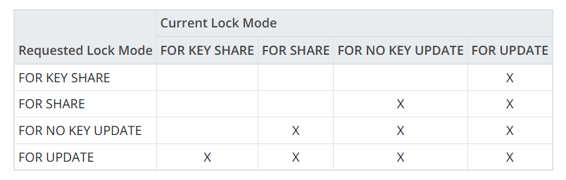

- 加表锁: `LockRelationOid`
- 释放锁: `LockReleaseAll`

# 重型锁的本质与逻辑

1. 锁是什么？

- 非实体空间：锁不占用磁盘 Page 或数据文件，它仅存在于共享内存的“锁表”中。
- 逻辑契约：它是一组结构体（Struct）。本质是进程间的一种“声明”：我正在操作这个对象，其他人请遵守冲突规则。

2. 核心结构：如何代表逻辑？

- 锁通过 `LOCKTAG` 将物理实体映射为逻辑符号：
- 映射关系：将 `Database OID + Table OID` 组合成一个 16 字节的“身份证号”。
- 哈希槽位：无论表有多大（几千个 Page），它们在锁表中都指向同一个 `LOCKTAG` 槽位。锁定标签即锁定了逻辑对象。
- 冲突矩阵 (Conflict Matrix). 如果 `Matrix[已持有][申请]` 为真，逻辑上就判定为“冲突”。
-

3. 进程与事务的关系

- 一比一绑定：在 PG 中，一个后台进程在同一时刻只能运行一个事务。
- 同步手段：锁通过操作系统的信号量（Semaphore）机制，强迫产生冲突的进程（即事务）在时间轴上由“并行”转为“串行”。

1. 运行机制：发现冲突后的“休眠”
2. 查表：进程 B 计算 `LOCKTAG` 哈希，发现进程 A 已持有冲突模式。
3. 挂起：进程 B 将自己挂入该锁的 `waitProcs` 链表，进入操作系统的休眠状态。
4. 唤醒：进程 A 事务结束释放锁，通过信号量“踢醒”进程 B，同步完成。

### Table-Level Locks

### Row-Level Locks

