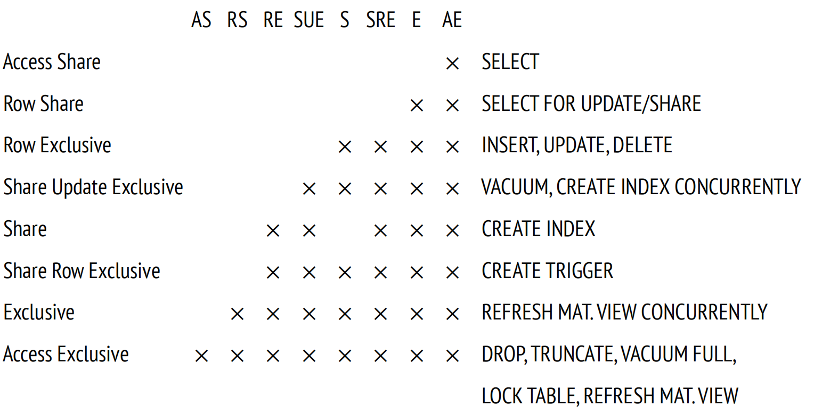

# Lock Overview

## Overview

PostgreSQL 基于 **MVCC** 机制实现了**读写无阻塞**，允许事务通过快照访问历史版本数据；然而针对**写写冲突**，系统仍需依赖**锁机制**进行协调，以确保同一行数据在并发修改时的原子性与一致性。

1. 初始化数据

```sql
create table tb
insert into tb values
```

2. Txn 1

```sql
begin;
update tb set a = 1;
```

3. Txn 2

```sql
begin;
update tb set a = 2; -- blocked
```


2. Locks

```c
#define AccessShareLock			 1	/* SELECT */
#define RowShareLock			 2	/* SELECT FOR UPDATE/FOR SHARE */
#define RowExclusiveLock		 3	/* INSERT, UPDATE, DELETE */
#define ShareUpdateExclusiveLock 4	/* VACUUM (non-FULL), ANALYZE, CREATE INDEX CONCURRENTLY */
#define ShareLock				 5	/* CREATE INDEX (WITHOUT CONCURRENTLY) */
#define ShareRowExclusiveLock	 6	/* like EXCLUSIVE MODE, but allows ROW SHARE */
#define ExclusiveLock			 7	/* blocks ROW SHARE/SELECT...FOR UPDATE */
#define AccessExclusiveLock		 8	/* ALTER TABLE, DROP TABLE, VACUUM FULL, and unqualified LOCK TABLE */
```

[Table-Level Locks](https://www.postgresql.org/docs/18/explicit-locking.html#LOCKING-TABLES)

[PostgreSQL Lock Conflicts](https://pglocks.org/)

3. conflict matrix



```text
业务操作
│
├─ SELECT
│
├─ 写操作
│  INSERT / UPDATE / DELETE
│
├─ 维护操作
│  VACUUM / ANALYZE
│
├─ 弱DDL
│  CREATE INDEX
│  CREATE TRIGGER
│
└─ 强DDL
   ALTER TABLE
   DROP TABLE
   TRUNCATE
```
