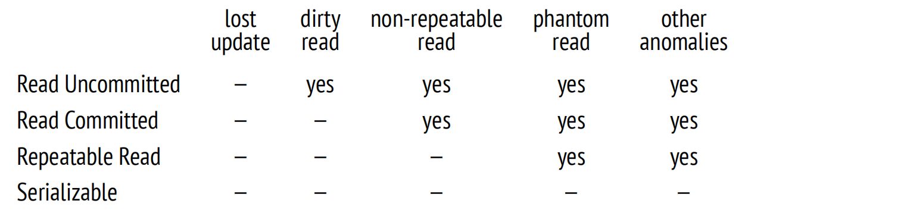
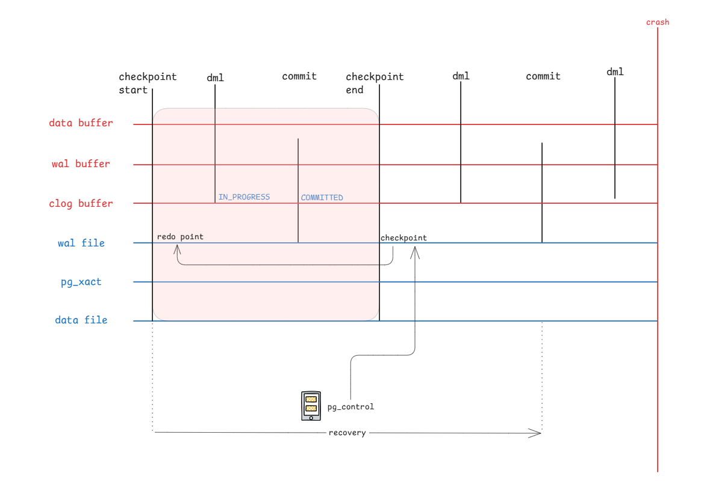

# Transaction

- 隔离性: https://postgres-internals.cn/docs/chapter02/
- 快照: https://postgres-internals.cn/docs/chapter04/
- 预写式日志: https://postgres-internals.cn/docs/chapter10/
- WAL: https://www.interdb.jp/pg/pgsql09/index.html
- 锁: https://postgres-internals.cn/docs/chapter12/
- 并发: https://www.interdb.jp/pg/pgsql05/index.html

| **事务特性**   | **核心实现方式**                                | **关键补充 (内核视角)**                                  |
| -------------- | ----------------------------------------------- | -------------------------------------------------------- |
| **隔离性 (I)** | **MVCC** (快照隔离) + **Lock Manager** (锁机制) | DDL 也是基于 MVCC。**2PL (两阶段锁)** 用于处理读写冲突。 |
| **持久性 (D)** | **WAL** (预写日志) + **Checkpointer**           | 还有 **Double Write** 机制（在某些存储环境下）防止半写。 |
| **原子性 (A)** | **CLog** (状态位) + **WAL**                     | 事务提交本质上是修改 CLog 里的 2 个 bit 位。             |
| **一致性 (C)** | 它是 A+I+D 的综合结果 + **数据完整性约束**      | 包括 唯一索引、外键、Check 约束等主动校验。              |

## 隔离级别



[图示隔离级别和相关异常](assets/draw_iso.md)

## 丢失更新

丢失更新是“基于过时前提做出的正确决定”。

- **事务本身没问题**：指令是合法的。
- **并发逻辑有问题**：它掩盖了数据状态的真实演变过程。

```sql
create table tb(id int, account int);
insert into tb(id, account) values (1, 100);
```

| 事务A                                              | 事务B                                              |
| ------------------------------------------------ | ------------------------------------------------ |
| `BEGIN ISOLATION LEVEL READ COMMITTED;`          |                                                  |
|                                                  | `BEGIN ISOLATION LEVEL READ COMMITTED;`          |
| `select * from tb;`                              |                                                  |
|                                                  | `select * from tb;`                              |
| `update tb set account = 100 + 50 where id = 1;` |                                                  |
| `commit`                                         |                                                  |
|                                                  | `update tb set account = 100 - 20 where id = 1;` |
|                                                  | `commit`                                         |
| `select * from tb;` 结果为80，丢失+50                  |                                                  |

解决方法:

1. 使用RR隔离级别`BEGIN ISOLATION LEVEL REPEATABLE READ;`
2. 使用行级锁 `select * from accounts for update;`
3. 使用原子更新 `update accounts set balance = balance + 50 where id = 1;`

## 持久性

wal

[draw_wal](assets/draw_wal.md)

checkpoint 触发时机

- 时间触发：后台 checkpoint 进程会定时检查时间，如果距离上次 checkpoint 执行开始时的间隔超过了指定值，就会触发 checkpoint。这个指定值是配置文件的checkpoint_timeout 值，范围在 30s ~ 1 day，默认值为300s。
- wal日志：当最新的 wal 日志，和上次 checkpoint 的刷新点的距离大于指定值，就会触发 checkpoint。
- 手动触发：当用户执行checkpoint命令也会触发，这个命令必须由超级用户才能执行。
- 数据库关闭：当数据库正常关闭时，会触发一次 checkpoint 。
- 基础备份：当进行数据基础备份时，会执行pg_start_backup命令，触发 checkpoint。
- 数据库崩溃修复：数据库异常退出后，比如数据库进程被kill -9，来不及清理操作 。在重新启动时，会进行崩溃修复，修复完成后会触发 checkpoint。



## `pg_walinspect` 介绍

- 代码位于 `postgres/contrib/pg_walinspect/`，编译后使用 

```sh
# 1. 自动获取PG服务端头文件目录（模糊化安装路径） 
PG_INCLUDE=$(~app/pgdebug/bin/pg_config --includedir-server) 

# 2. 编译扩展（指定PG版本+头文件路径） 
make PG_CONFIG=~app/pgdebug/bin/pg_config CPPFLAGS="-I$PG_INCLUDE" 

# 3. 安装扩展（指定PG版本） 
make install PG_CONFIG=~app/pgdebug/bin/pg_config

# 4. 客户端安装扩展到数据库实例
create extension pg_walinspect;
```