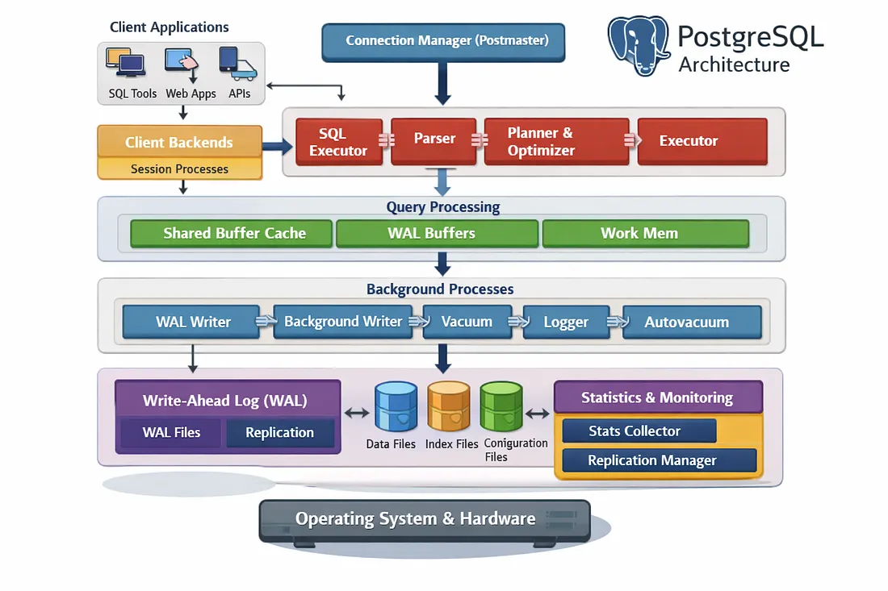
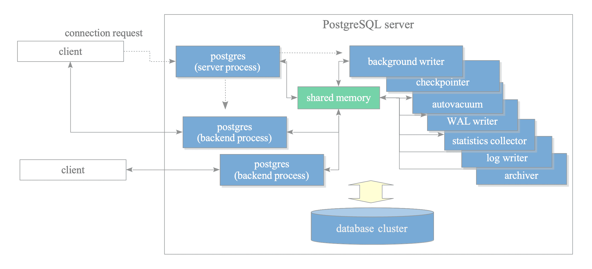

# Architecture

## Process Architecture

> https://medium.com/@reetesh043/ee5b24b52a30

> https://www.interdb.jp/pg/pgsql02/01.html

## PG 内核全景

- **控制**：分析, 优化, 执行
- **数据**：访问方法(Heap/Index, **Buffer Cache**, 物理磁盘)
- **事务**：Lock Manager, WAL/CLOG, MVCC (Visible check)
- **元数据**：Syscache(系统表缓存), Relcache(表定义缓存)
- **运行**：MemoryContext, 信号量/共享内存, 辅助进程
