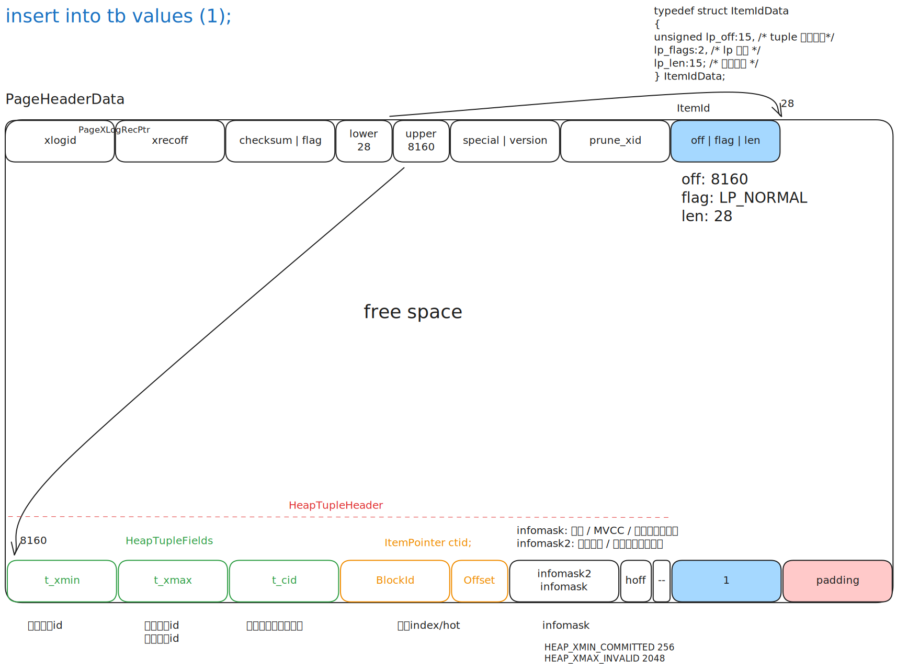

# insert



- 调试语句：`insert into tb values(1)`

- insert 核心流程梳理，将从最简单的插入数据开始，逐步讨论事务、锁、资源管理等相关内容
- 调试语句：`insert into tb values(1)`

## `exec_simple_query` 流程概览

```cpp
start_xact_command
pg_parse_query
pg_analyze_and_rewrite_fixedparams
pg_plan_queries
PortalDefineQuery
PortalRun | PortalRunMulti | ProcessQuery /* tcop */
EndCommand
finish_xact_command
```

## `exec_simple_query` 流程详解-插入数据

```cpp
/* ... */
pg_plan_queries
CreatePortal
PortalDefineQuery
PortalStart
PortalRun | PortalRunMulti | ProcessQuery /* tcop */
    CreateQueryDesc
    ExecutorStart
    ExecutorRun | standard_ExecutorRun | ExecutePlan | ExecProcNode | ExecProcNodeFirst /* executor */
        ExecModifyTable | ExecInsert /* executor */
            table_tuple_insert       /* access/tableam.h call Relation::TableAmRoutine::tuple_insert */
                heapam_tuple_insert  /* access/heap/heapam_handler.c */
                    heap_insert      /* access/heap/heapam.c */
                        RelationGetBufferForTuple /* access/heap/hio.c */
                        RelationPutHeapTuple      /* access/heap/hio.c */
                            PageAddItemExtended   /* storage/page/bufpage.c */
                        MarkBufferDirty(buffer)   /* storage/buffer/bufmgr.c */
                        XLogInsert /* access/transam/xloginsert.c */
                            XLogRecordAssemble
                            XLogInsertRecord
                        PageSetLSN
    ExecutorFinish
PortalDrop
EndCommand
finish_xact_command
```

## `exec_simple_query` 流程详解-提交事务

```cpp
start_xact_command
pg_parse_query
pg_analyze_and_rewrite_fixedparams
pg_plan_queries
CreatePortal
PortalDefineQuery
PortalStart
PortalRun | PortalRunMulti | ProcessQuery /* tcop */
PortalDrop
EndCommand
finish_xact_command
    CommitTransactionCommand
        CommitTransaction
            s->state = TRANS_COMMIT;
            RecordTransactionCommit
                XactLogCommitRecord
                    XLogInsert
                XLogFlush /* wal -> disk */
                TransactionIdCommitTree
                    TransactionIdSetTreeStatus
                        TransactionIdSetPageStatus
                            TransactionIdSetPageStatusInternal
            s->state = TRANS_DEFAULT;
    xact_started = false;
```


## `exec_simple_query` 流程详解-完整过程

```cpp
start_xact_command
    StartTransactionCommand
        StartTransaction
            s->state = TRANS_START;
            /* initialize current transaction state fields */
            /* ... */
            s->state = TRANS_INPROGRESS;
    xact_started = true;
pg_parse_query
pg_analyze_and_rewrite_fixedparams
pg_plan_queries
CreatePortal
PortalDefineQuery
PortalStart
PortalRun | PortalRunMulti | ProcessQuery /* tcop */
    CreateQueryDesc
    ExecutorStart
    ExecutorRun | standard_ExecutorRun | ExecutePlan | ExecProcNode | ExecProcNodeFirst /* executor */
        ExecModifyTable | ExecInsert /* executor */
            table_tuple_insert       /* access/tableam.h call Relation::TableAmRoutine::tuple_insert */
                heapam_tuple_insert  /* access/heap/heapam_handler.c */
                    heap_insert      /* access/heap/heapam.c */
                        RelationGetBufferForTuple /* access/heap/hio.c */
                        RelationPutHeapTuple      /* access/heap/hio.c */
                            PageAddItemExtended   /* storage/page/bufpage.c */
                        MarkBufferDirty(buffer)   /* storage/buffer/bufmgr.c */
                        XLogInsert /* access/transam/xloginsert.c */
                            XLogRecordAssemble
                            XLogInsertRecord
                        PageSetLSN
    ExecutorFinish
PortalDrop
EndCommand
finish_xact_command
    CommitTransactionCommand
        CommitTransaction
            s->state = TRANS_COMMIT;
            RecordTransactionCommit
                XactLogCommitRecord
                    XLogInsert
                XLogFlush /* wal -> disk */
                TransactionIdCommitTree
                    TransactionIdSetTreeStatus
                        TransactionIdSetPageStatus
                            TransactionIdSetPageStatusInternal
            s->state = TRANS_DEFAULT;
    xact_started = false;
```


## insert 的延迟状态更新

依赖扩展: `pageinspector`: 用于直接查看页面和元组信息

```sql
drop table if exists tb;
create table tb(a int);
```

关闭自动提交并插入数据

```sql
\set AUTOCOMMIT off
insert into tb values (1);
```

插入后不提交，此时新开一个 psql 客户端无法查询到 tb 中的数据，但是使用 pageinspector 工具可以看到已经有记录已经占据了页面空间，upper 为 8160

```sql
select from tb;
(0 rows)

select * from page_header(get_raw_page('tb', 0));
+-----------+----------+-------+-------+-------+---------+----------+---------+-----------+
|    lsn    | checksum | flags | lower | upper | special | pagesize | version | prune_xid |
+-----------+----------+-------+-------+-------+---------+----------+---------+-----------+
| 0/2A5EB38 |        0 |     0 |    28 |  8160 |    8192 |     8192 |       4 |         0 |
+-----------+----------+-------+-------+-------+---------+----------+---------+-----------+
(1 row)
```

此时 t_xmin 表示插入数据的事务 id

```sql
select lp, lp_off, lp_flags, lp_len, t_xmin, t_xmax, t_field3, t_ctid, t_infomask from heap_page_items(get_raw_page('tb', 0));
+----+--------+----------+--------+--------+--------+----------+--------+------------+
| lp | lp_off | lp_flags | lp_len | t_xmin | t_xmax | t_field3 | t_ctid | t_infomask |
+----+--------+----------+--------+--------+--------+----------+--------+------------+
|  1 |   8160 |        1 |     28 |   1228 |      0 |        0 | (0,1)  |       2048 |
+----+--------+----------+--------+--------+--------+----------+--------+------------+
```

`lp`: 行指针序号
`lp_off`: 页面内物理偏移量
`lp_flags`: 状态标记(1: LP_NORMAL， 2: REDIRECT, 3: DEAD, 0: UNUSED)
`lp_len`: 元组长度。这行数据（含头+数据+对齐）总共占用了 28 字节，实际存储占用 32 字节（8 字节对齐）
`t_xmin`: 插入事务 ID。表示这个元组是由事务号为 1228 的操作创建的
`t_xmax`: 删除/锁定事务 ID。0 表示该行目前是“活的”，尚未被删除或更新
`t_field3`: 命令 ID (t_cid)。表示这是事务 1228 里的第几个命令（从 0 开始计数）
`t_ctid`: 物理指针, 指向最新版本
`t_infomask`: 状态信息， `HEAP_XMAX_INVALID`

此时执行提交

```sql
commit;
```

再次使用 heap_page_items 发现 `t_infomask` 无变化

```sql
select lp, lp_off, lp_flags, lp_len, t_xmin, t_xmax, t_field3, t_ctid, t_infomask from heap_page_items(get_raw_page('tb', 0));
+----+--------+----------+--------+--------+--------+----------+--------+------------+
| lp | lp_off | lp_flags | lp_len | t_xmin | t_xmax | t_field3 | t_ctid | t_infomask |
+----+--------+----------+--------+--------+--------+----------+--------+------------+
|  1 |   8160 |        1 |     28 |   1228 |      0 |        0 | (0,1)  |       2048 |
+----+--------+----------+--------+--------+--------+----------+--------+------------+
```

另启客户端访问一下 tb

```sql
select from tb;
```

```sql
select lp, lp_off, lp_flags, lp_len, t_xmin, t_xmax, t_field3, t_ctid, t_infomask from heap_page_items(get_raw_page('tb', 0));
+----+--------+----------+--------+--------+--------+----------+--------+------------+
| lp | lp_off | lp_flags | lp_len | t_xmin | t_xmax | t_field3 | t_ctid | t_infomask |
+----+--------+----------+--------+--------+--------+----------+--------+------------+
|  1 |   8160 |        1 |     28 |   1228 |      0 |        0 | (0,1)  |       2304 |
+----+--------+----------+--------+--------+--------+----------+--------+------------+
```

再次使用 `heap_page_items` 发现 `t_infomask` 变为 2304 = 2048 + 256 = `HEAP_XMIN_COMMITTED` + `HEAP_XMAX_INVALID`

解释：基于 Hint Bits 的延迟状态更新

事务状态的判定权在日志（CLOG），而页面上的标记（Hint Bits）只是为了加速访问而做的“缓存回填”。

1. 事务提交阶段 (Commit Phase)

- 动作：当执行 COMMIT 时，数据库仅在 WAL (预写日志) 和 CLOG (事务状态日志) 中记录该事务已完成。
- 状态：此时，磁盘数据页（Data Page）里的元组完全没有被触碰，元组头部的 t_infomask 中，XMIN_COMMITTED 位依然为 0。
- 目的：保证提交操作是“轻量级”的，避免因修改大量数据页而导致的同步 I/O 阻塞。

2. 首次访问阶段 (First Access / Hint Bit Setting)

- 触发：事务提交后的第一个“路过”该元组的扫描进程（可以是查询、手动 Vacuum 等）发现该行没有提交标记。
- 检查：进程根据元组的 t_xmin 去内存中的 CLOG 缓存查找该事务的真实状态。
- 设置：一旦确认事务已提交，该进程会直接在内存缓冲区（Buffer Cache）中修改该元组的 t_infomask，将其 HEAP_XMIN_COMMITTED 位置为 1。
- 刷盘：这个带有“标记”的页面随后会由后台进程（Checkpointer 或 BgWriter）异步刷回磁盘。

3. 事务回滚阶段 (Rollback Phase)

- 标记：如果事务执行了 ROLLBACK，同样地，页面不会立即变化。
- 判定：后续进程查 CLOG 发现事务已回滚。
- 操作：进程将元组的 t_infomask 中的 HEAP_XMIN_INVALID 位置为 1。
- 后果：这行数据从此变成了“脏数据”或“陈旧元组”。虽然它物理上还占着那 32 字节的空间，但所有查询都会直接无视它。
