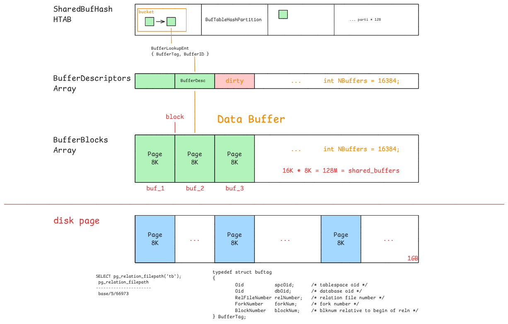

# Buffer Overview

## 核心价值

- **读优化:** 内存比磁盘快几个数量级。数据页首次读取后缓存在内存，后续访问直接命中内存，不再触发慢速磁盘 I/O。
- **写优化:** 修改数据时先只改内存（标记为脏页），然后通过后台进程**异步、批量**刷回磁盘。避免每次修改都直接卡在慢速磁盘写上。

## 缓存结构



### BufferMapping

- `SharedBufHash`
- `buf_table.c`
- mapping BufferTags to buffer indexes

```c
/* entry for buffer lookup hashtable */
typedef struct
{
	BufferTag	key;			/* Tag of a disk page */
	int			id;				/* Associated buffer ID */
} BufferLookupEnt;
```

```c
typedef struct buftag
{
	Oid			spcOid;			/* tablespace oid */
	Oid			dbOid;			/* database oid */
	RelFileNumber relNumber;	/* relation file number */
	ForkNumber	forkNum;		/* fork number */
	BlockNumber blockNum;		/* blknum relative to begin of reln */
} BufferTag;
```

### `BufferDescriptors`

- `BufferDescPadded *BufferDescriptors;`

```c
typedef struct BufferDesc
{
	BufferTag	tag;			/* ID of page contained in buffer */
	int			buf_id;			/* buffer's index number (from 0) */

	/* state of the tag, containing flags, refcount and usagecount */
	pg_atomic_uint32 state;

	int			wait_backend_pgprocno;	/* backend of pin-count waiter */
	int			freeNext;		/* link in freelist chain */
	LWLock		content_lock;	/* to lock access to buffer contents */
} BufferDesc;
```

### `BufferBlocks`

- `char *BufferBlocks;`
- shared memory
- shared_buffers = 128M

## 其他缓存

### `Ring Buffer`

When reading or writing a **huge** table, PostgreSQL uses a ring buffer instead of the buffer pool.

The ring buffer is a small, **temporary** buffer area. It is allocated in shared memory when any of the following conditions is met:

1. Bulk-reading: When scanning a relation whose size exceeds one-quarter of the buffer pool size (shared_buffers/4). In this case, the ring buffer size is 256 KB.

2. Bulk-writing: When executing the following SQL commands, the ring buffer size is 16 MB:
   - [COPY FROM](http://www.postgresql.org/docs/current/static/sql-copy.html) command.
   - [CREATE TABLE AS](http://www.postgresql.org/docs/current/static/sql-createtableas.html) command.
   - [CREATE MATERIALIZED VIEW](http://www.postgresql.org/docs/current/static/sql-creatematerializedview.html) or [REFRESH MATERIALIZED VIEW](http://www.postgresql.org/docs/current/static/sql-refreshmaterializedview.html) command.
   - [ALTER TABLE](http://www.postgresql.org/docs/current/static/sql-altertable.html) command.

3. Vacuum-processing:
   When an autovacuum process performs vacuuming. In this case, the ring buffer size is 256 KB.

### `Local Buffer`

When a backend creates a temporary table, the buffer manager allocates a memory area for the backend and creates a local buffer.

## 脏页落盘

- Checkpointer: 缩短崩溃恢复（Crash Recovery）时间
- Background Writer: 保证 Backend 进程随时有干净的 Buffer 可用(提前把 `nextVictimBuffer` 指针前方的脏页刷出)

## 参考文档

- https://www.interdb.jp/pg/pgsql08/index.html
