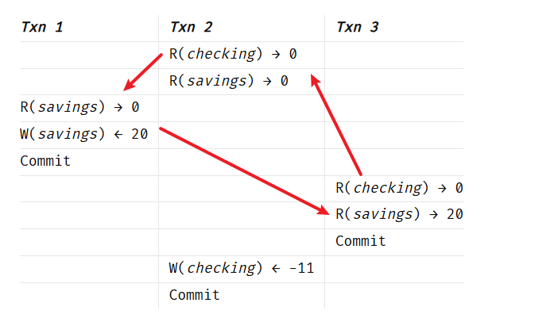

# Repeatable Read and SERIALIZABLE

**读已提交**作为大多数数据库的默认隔离级别，已被广泛应用并为开发者所熟知。其可能产生的**不可重复读**和**幻读**等现象也相对容易理解。本文将简要介绍**可重复读**隔离级别下可能出现的写偏斜问题，并进一步概述 PostgreSQL 串行化隔离级别的实现机制。

## Repeatable Read

### 写偏移(Write Skew)

PostgreSQL 的事务隔离级别主要基于 MVCC（多版本并发控制）机制实现，其中读已提交（RC）与可重复读（RR）的核心差异体现在快照的获取时机：RC 隔离级别下，**每条 SQL 语句**执行时都会生成并使用全新的快照；而 RR 隔离级别**仅在事务启动时生成一次快照**，后续所有语句均复用该事务快照。这一机制从根本上让 RR 避免了不可重复读和幻读异常的发生，但需注意，可重复读隔离级别下仍可能出现 “写偏移”（Write Skew）的并发异常。

写偏移异常示例：

假设表中有两名员工A和B，用 1 表示值班，0 表示休假，规定二者不能同时休假，因此A和B申请休假时，需检查是否已有人值班，SQL模拟如下

1. 初始化数据

```sql
drop table if exists stuff;

create table stuff (
    name text primary key,
    status int  -- 0 = 休假, 1 = 值班
);

insert into stuff values ('A', 1), ('B', 1);

select * from stuff;

-- 创建 procedure 更新状态，输入参数为员工名称
create or replace procedure update_status(p_name text)
as $$
begin
	update stuff
	set status = 0
	where name = p_name
    and (select count(*) from stuff where name != p_name and status = 1) > 0;
end;
$$ language plpgsql;
```

2. 并发更新

| Employee A                                           | Employee B                                           |
| ---------------------------------------------------- | ---------------------------------------------------- |
| `start transaction isolation level repeatable read;` | `start transaction isolation level repeatable read;` |
| `call update_status('A');`                           |                                                      |
|                                                      | `call update_status('B');`                           |
| `commit;`                                            | `commit;`                                            |

3. 最终结果

```sql
postgres=# select * from stuff;
+------+--------+
| name | status |
+------+--------+
| A    |      0 |
| B    |      0 |
+------+--------+
```

基于完全正确的基础数据前提，因计算 / 定位时的微小偏移（如索引、行数、边界值），最终得出了完全错误的结果。

[Write Skew](https://blog.ratnesh-maurya.com/technical-terms/write-skew/):

> Write skew is an anomaly where two concurrent transactions each read overlapping data and then write non-overlapping fields, resulting in an overall invalid state despite no single column being overwritten.
>
> 写偏斜是一种异常现象：两个并发事务分别读取了重叠的数据集合，然后各自写入互不重叠的字段，尽管没有任何单个列被同时覆盖，但最终却导致整体数据状态变为无效或违反约束。


---

### 只读事务异常(Read-Only Transaction Anomaly)

[Analyzing a read-only transaction anomaly under snapshot isolation](https://johann.schleier-smith.com/blog/2016/01/06/analyzing-a-read-only-transaction-anomaly-under-snapshot-isolation.html)

定义

即使一个事务只进行读操作（不修改数据），它在可重复读隔离级别下看到的数据状态，在逻辑上也可能是不一致的，无法对应任何串行执行的结果。

- 快照隔离允许事务看到某个时间点的数据版本。
- 但是，它不检查**读写依赖**。如果两个并发写事务修改了不同的行，但这两行数据在业务逻辑上是关联的（例如有约束关系），只读事务可能会看到一个“中间状态”，这个状态在任何串行执行顺序下都不应该存在。

示例

- Fekete 等人提供的示例涉及一家银行，客户在该银行同时拥有支票账户（checking account）和储蓄账户（savings account）
- 如果取款导致合并余额为负，则银行会收取透支费用

在示例中，支票账户和储蓄账户的初始余额均为 0，随后发生以下并发事务：

- **事务 1**：向储蓄账户存入 20。
- **事务 2**：从支票账户扣除 10。如果此举导致（支票账户 + 储蓄账户）变为负数，则额外扣除 1 作为透支费。
- **事务 3**：读取余额（支票账户，储蓄账户）。

| _Txn 1_           | _Txn 2_             | _Txn 3_           |
| ----------------- | ------------------- | ----------------- |
|                   | R(_checking_) → 0   |                   |
|                   | R(_savings_) → 0    |                   |
| R(_savings_) → 0  |                     |                   |
| W(_savings_) ← 20 |                     |                   |
| Commit            |                     |                   |
|                   |                     | R(_checking_) → 0 |
|                   |                     | R(_savings_) → 20 |
|                   |                     | Commit            |
|                   | W(_checking_) ← -11 |                   |
|                   | Commit              |                   |

**分析**：

- 由于事务 3 在事务 1 提交后才开始读取，因此它看到了储蓄账户的存款入账。
- 然而，因为事务 2 在事务 1 提交之前就已经启动，所以它没有看到这笔存款，因此对支票账户收取了透支费。
- 事务 1 与事务 2 是并发的，且最终结果与“事务 2 先于事务 1"的串行顺序一致。
- 然而，事务 3 的输出（与事务 2 并发但不与事务 1 并发）却与相反的串行顺序一致，即“事务 1 先于事务 2"。
- 归根结底，事务 3 的输出无法与产生最终状态的任何串行顺序相吻合。



**与“幻读”的区别**

- **幻读（Phantom Read）**：侧重于**行的数量**变化。比如第一次查询有 5 行，第二次查询变成了 6 行（有新行插入）。
- **只读事务异常**：侧重于**数据间的逻辑一致性**。行数可能没变，但数据值之间的关系违反了业务逻辑或约束。

SQL语句用例:

准备数据:

```sql
-- 0. 建表
CREATE TABLE bank_accounts (
    account_type VARCHAR(20) PRIMARY KEY,
    balance INT
);

-- 0. 初始化数据
INSERT INTO bank_accounts (account_type, balance) VALUES ('checking', 0), ('savings', 0);
```

TXN 2:

```sql
-- 1.设置隔离级别
BEGIN TRANSACTION ISOLATION LEVEL REPEATABLE READ;

-- 2. R(checking) -> 0
SELECT balance FROM bank_accounts WHERE account_type = 'checking';

-- 3. R(savings) -> 0
-- 因为事务开始得早，此时还没看到 Session 1 的提交，所以读到 0
SELECT balance FROM bank_accounts WHERE account_type = 'savings';

-- 11. W(checking) <- -11
UPDATE bank_accounts SET balance = -11 WHERE account_type = 'checking';

-- 12. Commit
COMMIT;
```

TXN 1:

```sql
-- 4. 设置隔离级别为 REPEATABLE READ (快照隔离)
BEGIN TRANSACTION ISOLATION LEVEL REPEATABLE READ;

-- 5. R(savings) -> 0
SELECT balance FROM bank_accounts WHERE account_type = 'savings';

-- 6. W(savings) <- 20 (实际是 update balance = balance + 20)
UPDATE bank_accounts SET balance = balance + 20 WHERE account_type = 'savings';

-- 7. Commit
COMMIT;
```


TXN 3:

```sql
-- 8. 在 Session 1 提交之后执行
BEGIN TRANSACTION ISOLATION LEVEL REPEATABLE READ;

-- 9. R(checking) -> 0, R(savings) -> 20
SELECT balance FROM bank_accounts;

-- 10. Commit
COMMIT;
```

当修改隔离级别为 SERIALIZABLE 时， 第 11 步更新报错

```
ERROR: could not serialize access due to read/write dependencies among transactions Reason code: Canceled on identification as a pivot, during write.

SQL state: 40001
Detail: Reason code: Canceled on identification as a pivot, during write. 
Hint: The transaction might succeed if retried.
```

解释：由于事务之间存在读/写依赖，无法序列化访问；PostgreSQL 的 **SSI（可串行化快照隔离）** 机制检测到了并发事务之间形成了**循环依赖**，如果允许这些事务全部提交，就会产生**只读事务异常**。因此，PG 主动回滚了其中一个事务来保证数据一致性。

## SERIALIZABLE

PostgreSQL 的 **SERIALIZABLE** 隔离级别基于 **SSI (Serializable Snapshot Isolation)** 算法实现。

1. 核心思想

SSI 的核心思想是 **“乐观并发控制 + 冲突依赖监控”**。

它允许事务像“可重复读”（Repeatable Read）一样完全并发执行，不引入任何阻塞读写的锁定，但在后台实时监控事务间的**读写依赖关系**。一旦发现可能导致逻辑不一致的“异常结构”，就强制回滚其中一个事务。

2. 三个关键技术支柱

- **SIReadLock (谓词锁/意向锁)**：
  当事务读取数据时，在内存中留下一个“哨兵”。它不阻塞任何人，仅记录“我读过这个范围”。
- **RW-Conflict (读写冲突检测)**：
  如果事务 A 读了某行，随后事务 B 修改了该行，系统记录一条从 A 到 B 的**依赖边**（$T1 \to T2$）。
- **危险结构识别 (Pivot Detection)**：
  SSI 监控依赖图中是否存在特定的环形冲突模式。关键发现：可序列化性被破坏当且仅当存在以下模式：$T1 \to T2 \to T1$ 时，即事务的读写冲突形成环，才可能发生破坏串行化的“写偏斜”异常，此时，系统中止其中一个事务以破坏环，恢复可序列化性。

3. 技术对比

| 维度     | 传统可串行化 (Lock-based)      | PostgreSQL SSI                     |
| -------- | ------------------------------ | ---------------------------------- |
| **手段** | **悲观**：读写互相阻塞（等锁） | **乐观**：读写完全并发（记录依赖） |
| **性能** | 并发度低，容易死锁             | 并发度高，但冲突时需**应用层重试** |
| **代价** | 时间损耗（等待）               | 资源损耗（监控依赖及回滚开销）     |
